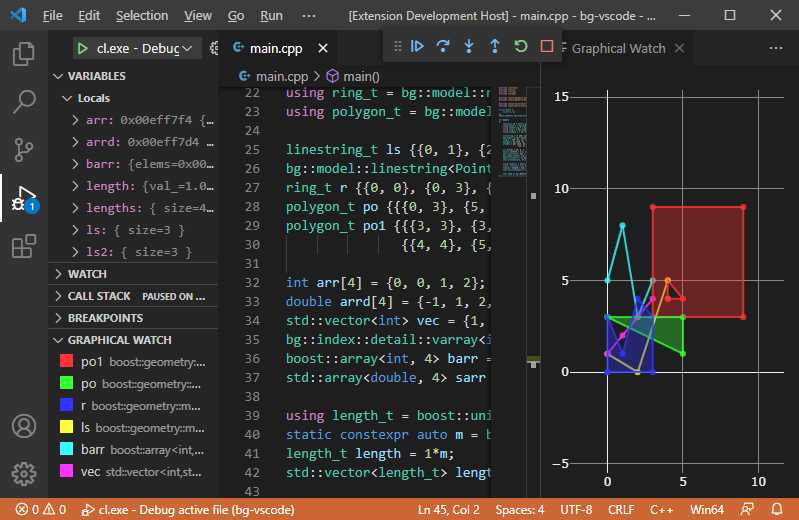

# Graphical Debugging
## extension for Visual Studio Code

This extension allows to display graphical representation of variables during debugging.

##### Instructions

1. Place a breakpoint
2. Start debugging
3. After clicking + in Graphical Watch write the name of a variable

##### Supported types

* Containers of values, points and other geometries
  * C-style array
  * STL: `array`, `vector`
  * Boost.Array: `array`
  * Boost.Geometry: `varray`
* 1D values
  * Boost.Units: `quantity`   
* 2D cartesian geometries
  * STL: `pair`
  * Boost.Geometry: `point`, `point_xy`, `point_xyz`, `linestring`, `ring`, `polygon`, `multi_point`, `multi_linestring`, `multi_polygon`
* User-defined types
  * see `*.json` files in `resources` directory
  * the directory containing user files can be defined in settings, by default it is the workspace directory of currently debugged program

##### Known issues

The extension doesn't work for variables defined with `typedef` with GDB. This issue [is known](https://github.com/microsoft/vscode-cpptools/issues/3038) and also affects the use natvis files. If [this proposal](https://github.com/microsoft/MIEngine/issues/1236) was implemented it could potentially allow to work around this issue.